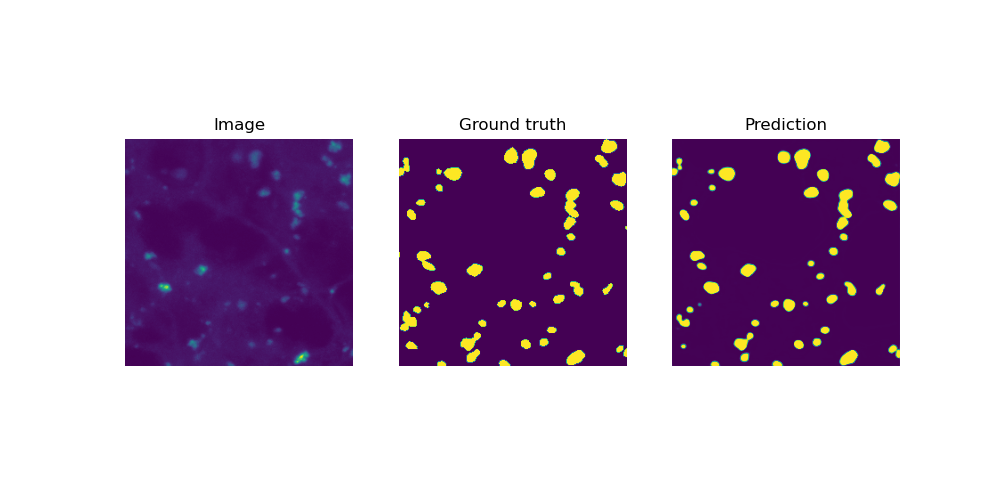

## Spot segmentation using CNN-based methods

### Installation of SegmentationModels 
Guidelines to install the SegmentationModels library can be found here: https://github.com/qubvel-org/segmentation_models.pytorch/tree/main
This library allows for toggling amongst many different CNN-based segmentation models. In this repository the Unet++ and cxx have been tested.

### Training and performance evaluation
The code folder includes python scripts for training on the spot data. It also includes scripts to evaluate the results in terms of performance metrics such as IoU, accuracy, precision.

